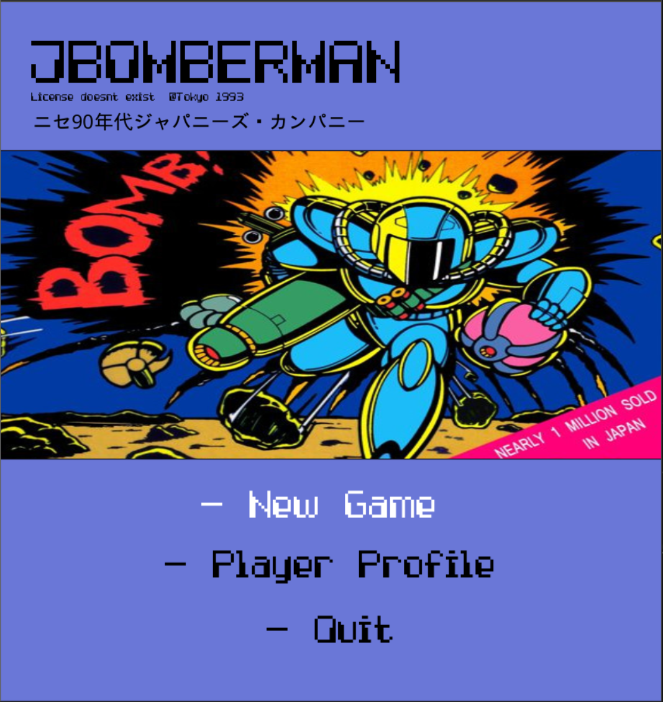
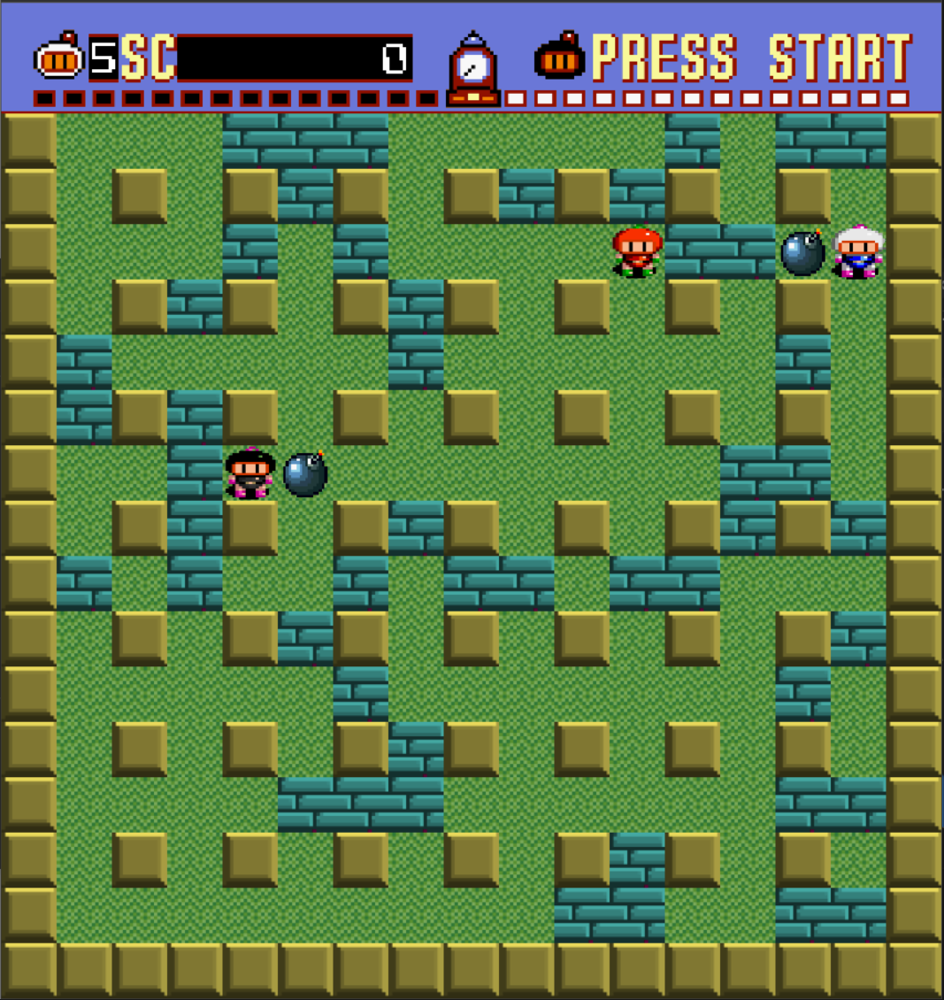
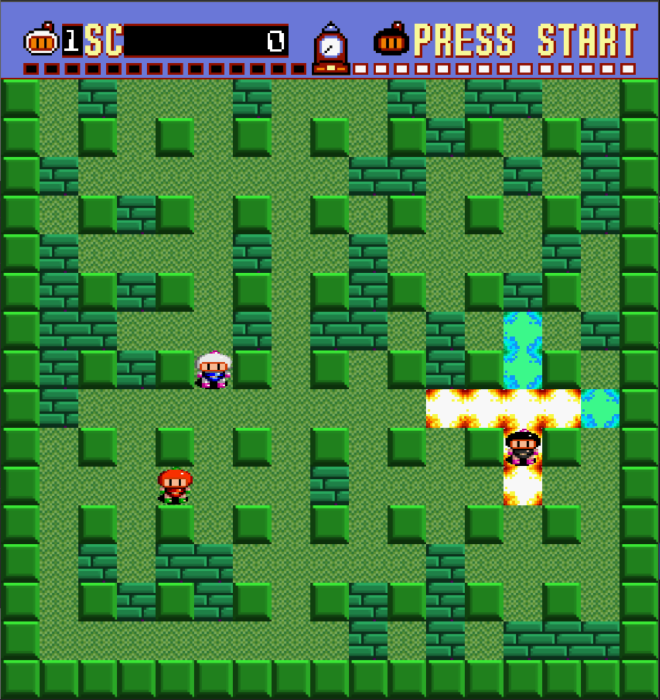
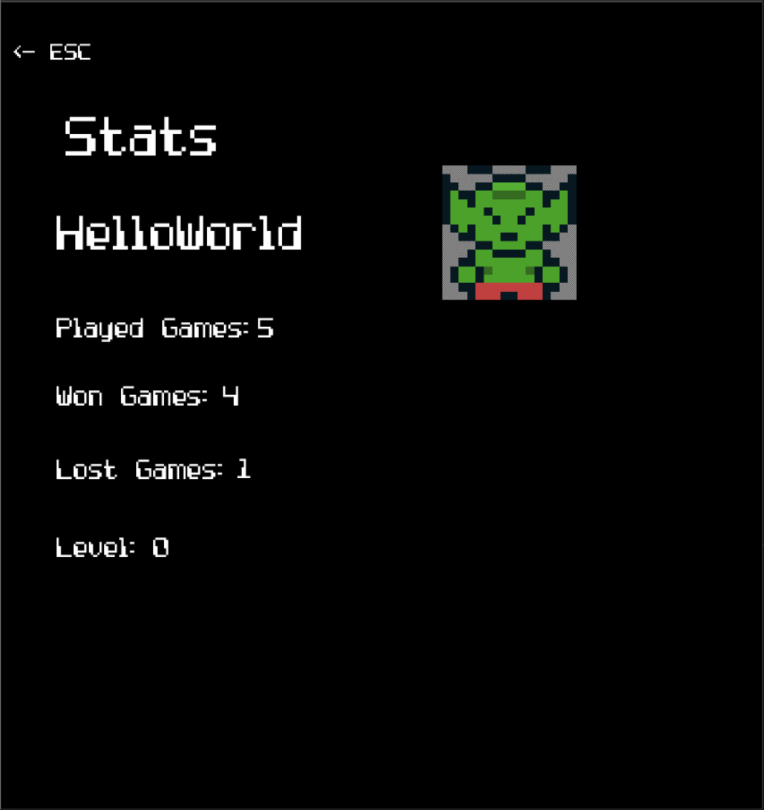

# Jbomber (SuperBomberMan bad clone)

## Table of Contents

- [Features](#features)
- [How to Play](#how-to-play)
- [Controls](#controls)
- [Screenshots](#screenshots)
- [Built With](#built-with)
- [Acknowledgments](#acknowledgments)

## Features

- Grid-based action gameplay inspired by the classic Bomberman
- Player and enemy characters with unique animations and behaviors
- Dynamically generated levels with destructible walls and obstacles
- MainMenu and GameOver screens for easy navigation and replayability
- Immersive audio experience with background music and sound effects
- Implemented using JavaFX for cross-platform compatibility

## How to Play

- The objective of JBomber is to navigate the grid, destroy walls, and defeat all enemies on the level.
- The player can place bombs to destroy walls and eliminate enemies.
- Be careful not to get caught in your own bomb's blast radius!
- Enemies have random movement patterns and will also place bombs to attack the player.

## Controls

- Menu: Arrow keys (Up, Down, Left, Right), Enter
- Movement: W,A,S,D
- Place Bomb: SpaceBar
- Pause: Esc

## Screenshots

## Built With

- JavaFX - The framework used for building the graphical interface and animations
- Java - The programming language used for the game logic

## Acknowledgments

- Thanks to the creators of Bomberman for the inspiration behind this game.
- Shoutout to the Java and JavaFX communities for their valuable resources and support.
